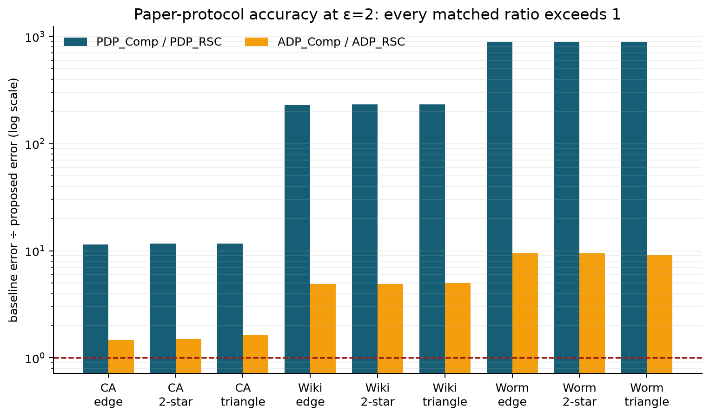
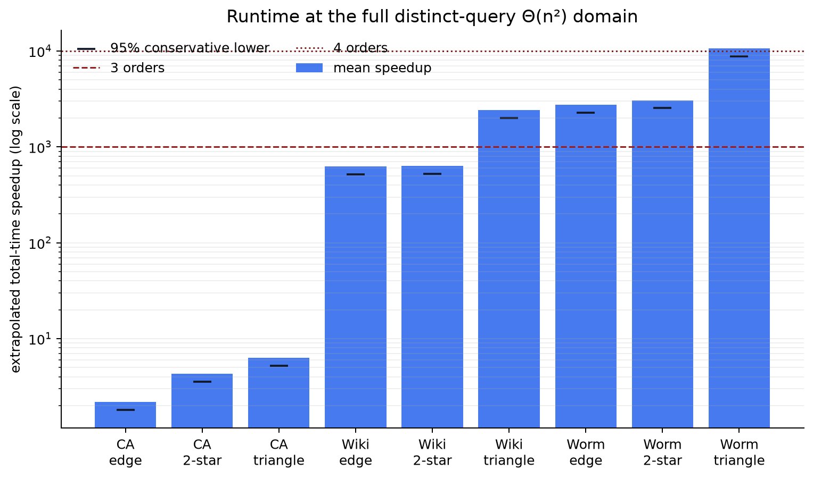
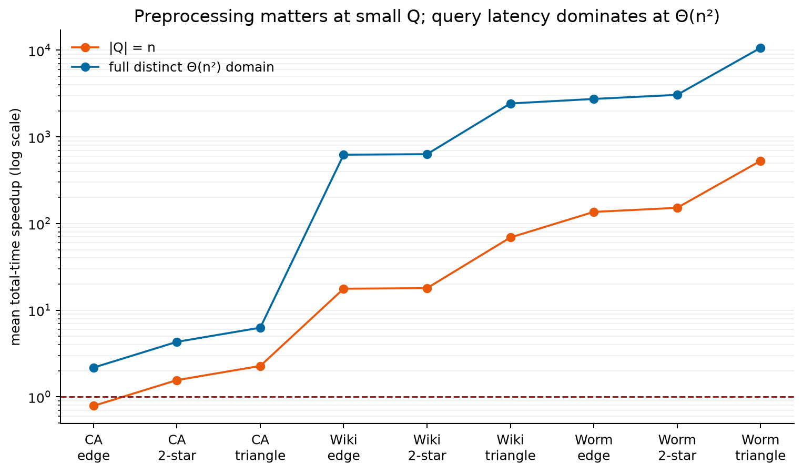
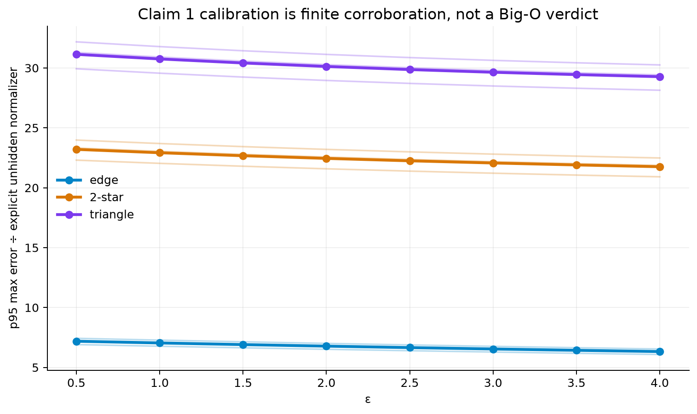
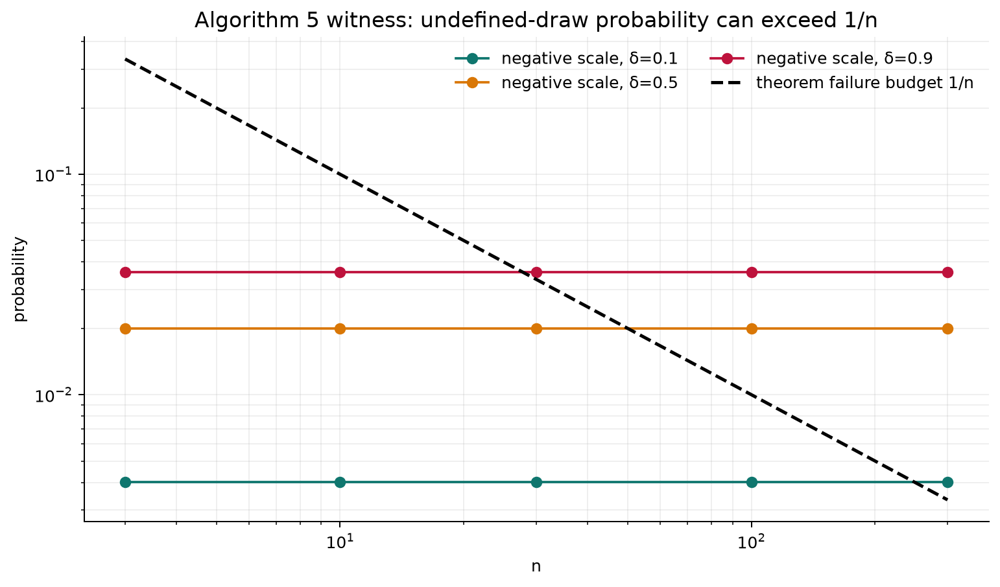

# Differential Privacy for Range Subgraphs: a Claim-by-Claim Reproduction



At the paper-default privacy setting, every one of the 18 displayed
proposed-versus-baseline accuracy ratios is above one. Across the complete
three-dataset, three-pattern, eight-epsilon protocol, all **144/144**
privacy-matched orderings hold. That is the strongest empirical result in this
reproduction. It is also narrower than the paper's theorems: it does not prove
an asymptotic error bound, a universal lower bound, or the validity of the
paper's approximate-DP construction.

The final scientific ledger is deliberately mixed:

| Claim | Result | Confidence | Central evidence |
| --- | --- | --- | --- |
| 1. Efficient approximate-DP existence theorem | **BLOCKED** | LOW | Four independent routes; named Algorithm 5 witness is invalid, but an existential theorem is not thereby falsified |
| 2. Dimension-dependent lower bound | **BLOCKED** | LOW | Reconstruction closes; a same-exponent partial-discrepancy step remains unproved after four routes |
| 3. Pure-DP Algorithms 1–3 and utility | **VERIFIED** | HIGH | Universal analytic certificate, 18,432 functional checks, independent checker, three failing controls |
| 4. Approximate-DP Algorithms 4–5 | **FALSIFIED** | HIGH | Valid positive-probability negative Laplace-scale counterexample, reproduced in released NumPy |
| 5. Section 5 accuracy and runtime | **BLOCKED** | MEDIUM | Full accuracy aligns; runtime trend aligns but literal 3–4 orders is not uniform on this hardware |

“Blocked” is not a pass. The projected score range is **7–8/10**, with 8/10
the best-supported forecast—not a judge result.

## The question

A range subgraph query asks: among vertices whose public attributes lie in a
given interval, how many edges, 2-stars, or triangles occur? Answering many
such queries privately is expensive if each query scans the graph and spends
part of a shared privacy budget. The paper's proposed solution projects
subgraph occurrences into a range tree, releases noisy tree nodes once, and
answers subsequent intervals by post-processing.

The claimed payoff has three parts. The pure-DP mechanism should have a
provable maximum-error bound. A higher-order local-sensitivity estimator should
extend it to approximate DP. Empirically, both mechanisms should beat
composition baselines in accuracy and—once the query count is large—runtime.
The paper also gives a universal lower bound that grows exponentially with
dimension.

The campaign tested each statement against its exact metric and quantifiers.
Finite experiments were not used to “prove” asymptotic theorems, and a flaw in
one construction was not used to falsify an existential statement.

## What was implemented

The fixed entrypoint is:

```bash
uv run --frozen python repro/src/run_campaign.py
```

Every experiment node uses that command unchanged, Python 3.12, one
repository-level `.venv`, and the committed `uv.lock`. Long or uncertain CPU
work ran on Hugging Face `cpu-upgrade`; short single-core checks ran locally.
The full cumulative run estimated 4 cores and 15–30 minutes, observed 64
logical CPUs, and finished its scientific suite in 1,036.093 seconds.

The consequential code path is small:

1. `find_patterns.py` enumerates edge, 2-star, or triangle occurrences.
2. `ourAlg.py` projects each occurrence to public-rank endpoints and builds
   the noisy range-tree representation.
3. `range_tree.py::querySplit` decomposes an interval into canonical nodes.
4. `baseline.py` filters the exact induced subgraph and counts occurrences for
   composition baselines.
5. Independent reproduction code reconstructs accuracy distributions,
   adaptive timing streams, privacy/utility proofs, and counterexamples.

The empirical protocol uses all released data: CA-Netscience
(379 nodes/914 edges), Wiki-Squirrel (5,201/198,353), and WormNet-v3
(16,347/762,822). Accuracy uses `ceil(n^1.5)` queries and 20 repetitions.
Runtime draws exact i.i.d. uniform distinct intervals, samples in batches until
relative standard error is below 5%, and extrapolates—as the paper does—to the
full distinct-query domain of order \(n^2\).

## Accuracy: the reported ordering is robust

At epsilon 2, the pure-DP baseline/proposed ratios range from **11.47x to
884.01x**; approximate-DP ratios range from **1.47x to 9.49x**. Across all
epsilon values, every one of 144 matched comparisons preserves the paper's
ordering. The checker fails if the old reduced query budget is substituted.

The raw paper-default WormNet-v3 means at epsilon 2 make the scale tangible:

| Pattern | PDP_RSC | PDP_Comp | ADP_RSC | ADP_Comp |
| --- | ---: | ---: | ---: | ---: |
| edge | 0.001890 | 1.668784 | 0.001169 | 0.011080 |
| 2-star | 0.115651 | 102.236264 | 0.033497 | 0.318046 |
| triangle | 1.722583 | 1522.760634 | 0.512518 | 4.720184 |

These are mean relative errors over 20 deterministic repetitions and
2,090,053 queries. They directly support the Section 5 accuracy ordering. They
do not verify Theorems 1.3 or 3.3, whose target is high-probability maximum
absolute error with hidden dimension-dependent constants.

## Runtime: scaling appears, but not uniformly



Every timing stream reached the paper's RSE-below-5% stop rule. At the full
distinct-query domain, mean total-time speedups range from **2.18x** on
CA-Netscience edge to **10,640x** on WormNet-v3 triangle. Conservative 95%
lower values range from **1.80x** to **8,785x**.

The paper's “3 to 4 orders” wording appears in the runtime paragraph—not in
the accuracy protocol, contrary to the imported judge paraphrase. This run
does reach that scale for large-graph cases, but not uniformly: CA is
2–6x, Wiki is 623–2,430x, and Worm is 2,742–10,640x. Since runtime depends on
hardware and the paper does not specify enough of its timing environment to
construct an assumption-matched contradiction, Claim 5 remains BLOCKED rather
than FALSIFIED.



The crossover explains the mechanism. Preprocessing can erase the advantage
when \(Q\) is small—the CA edge case is 0.79x at \(Q=n\)—but its one-time cost
is amortized as the query count grows. Baselines continue scanning the graph;
range-tree queries touch only canonical nodes. The deliberately biased
interval sampler is an effective negative control: the runtime verifier exits
nonzero.

## The theorem audits

Claim 3 is the clean proof-level success. The checker reconstructs four
universal steps:

- projection counts every occurrence exactly once, including tied attributes;
- edge adjacency changes the projection vector by at most scalar global
  sensitivity;
- each coordinate reaches only a bounded number of released range-tree nodes;
- vector Laplace privacy, an independently derived MGF tail, and a union bound
  yield the stated maximum-error order and probability.

The analytic certificate is supplemented—not replaced—by 9,216 projection
identities, 9,216 neighboring sensitivity checks, 1,296 independent
tied-attribute checks, and 3,393 high-precision concentration checks. Naive
tie handling, under-noising, and replacing maximum error by average error all
make their verifiers exit nonzero. Claim 3 is therefore VERIFIED/HIGH.

Claim 2 does not close. The paper-specific graph lift and DP reconstruction
algebra are machine-checked, and the reconstruction dependency was
independently re-proved. But Appendix D transfers a discrepancy lower bound
through \(k+1=\Theta(\log n)\) residual scales while retaining the same
logarithmic exponent. Exact-rational sequences such as \(f_j=j^{d-2}\) show
that every scale can be smaller by a factor \(\Theta(\log n)\) while their sum
still reaches the target. The alternative published theorem concerns average
squared error and loses the needed exponent when converted to maximum
absolute error. After exactly three verification routes and a fourth dedicated
falsification route, no theorem-level counterexample was found. Claim 2 is
BLOCKED/LOW.



Claim 1 required the same restraint. Its 72 finite summaries stay within a
stable range after division by the theorem's explicit, unhidden normalizer.
But no honest pass/fail threshold exists because the theorem hides
\(c^{O(d)}\) constants and quantifies over arbitrary query sets. This figure is
calibration, not verification.

## The approximate-DP construction has an invalid draw



For the empty three-vertex graph, a 2-star pattern, one-dimensional
attributes, a full-range query, epsilon 2, and delta \(10^{-5}\), all stated
input assumptions hold. Algorithm 4 returns a shifted Laplace variable and is
negative with probability \(\delta'/2>0\). Algorithm 5 passes that negative
value to a later Laplace distribution as its scale. The paper's own density
requires a positive scale; released NumPy raises `ValueError`.

An independent 60-digit checker recomputes the probability and the exact
released code behavior. Clipping the estimate removes this counterexample,
so a clipped repair is a meaningful negative control—but it is a different
mechanism and lacks the paper's privacy/utility proof. Claim 4, the named
Algorithm 4/5 guarantee, is FALSIFIED/HIGH.

The same issue matters to Claim 1's offered witness. On a predeclared grid,
the invalid-draw probability sometimes exceeds \(1/n\); at epsilon 2,
delta 0.9, and \(n=100\), it is 0.03605 versus a 0.01 failure budget.
Nevertheless, Theorem 1.3 says there exists an algorithm. Invalidating the
paper's construction does not prove that no other algorithm exists. After
four routes, Claim 1 is therefore BLOCKED/LOW.

## Experiment lineage

Every branch below used the exact same run command.

| Branch / experiment | Purpose | Exact run command | Assessment | Compute |
| --- | --- | --- | --- | --- |
| [`orx/validated-5-10-baseline`](https://github.com/MachineLearning-Nerd/icml26-repro-qypbyrxstg-dprsc/tree/orx/validated-5-10-baseline) | Freeze judged 5/10 state | `uv run --frozen python repro/src/run_campaign.py` | Historical baseline | Local, 1 core, 3.099 s |
| [`orx/claim-4-estimatehs-negative-scale-counterexample`](https://github.com/MachineLearning-Nerd/icml26-repro-qypbyrxstg-dprsc/tree/orx/claim-4-estimatehs-negative-scale-counterexample) | Test Algorithms 4–5 total-domain validity | `uv run --frozen python repro/src/run_campaign.py` | Claim 4 FALSIFIED/HIGH | Local, single-threaded, 4.139 s |
| [`orx/claim-3-pure-dp-proof-audit-and-visible-claim-4`](https://github.com/MachineLearning-Nerd/icml26-repro-qypbyrxstg-dprsc/tree/orx/claim-3-pure-dp-proof-audit-and-visible-claim-4) | Reconstruct pure-DP proof | `uv run --frozen python repro/src/run_campaign.py` | Claim 3 VERIFIED/HIGH | Local, single-threaded, 4.106 s |
| [`orx/claim-2-imported-lower-bound-lemma-audit`](https://github.com/MachineLearning-Nerd/icml26-repro-qypbyrxstg-dprsc/tree/orx/claim-2-imported-lower-bound-lemma-audit) | Audit lower-bound dependencies | `uv run --frozen python repro/src/run_campaign.py` | Claim 2 BLOCKED/LOW after four routes | Local, single-threaded |
| [`orx/claim-5-full-three-dataset-paper-protocol-reprod`](https://github.com/MachineLearning-Nerd/icml26-repro-qypbyrxstg-dprsc/tree/orx/claim-5-full-three-dataset-paper-protocol-reprod) | Full accuracy protocol | `uv run --frozen python repro/src/run_campaign.py` | 144/144 orderings hold | HF cpu-upgrade |
| [`orx/claim-5-adaptive-rse-runtime-and-cumulative-accu`](https://github.com/MachineLearning-Nerd/icml26-repro-qypbyrxstg-dprsc/tree/orx/claim-5-adaptive-rse-runtime-and-cumulative-accu) | Adaptive exact runtime protocol | `uv run --frozen python repro/src/run_campaign.py` | Claim 5 BLOCKED/MEDIUM | HF cpu-upgrade, 16m51s |
| [`orx/claim-1-theorem-audit-and-cumulative-full-scale`](https://github.com/MachineLearning-Nerd/icml26-repro-qypbyrxstg-dprsc/tree/orx/claim-1-theorem-audit-and-cumulative-full-scale) | Four-route Claim 1 audit and cumulative regression | `uv run --frozen python repro/src/run_campaign.py` | Claim 1 BLOCKED/LOW; cumulative PASS | HF cpu-upgrade, 17m46s |
| `master` | Publication surface | Not run as an experiment (publication surface) | README, report, notebook | None |

## Reproduce and inspect

The one fixed command regenerates the scientific records and exits nonzero if
a primary checker, independent checker, or expected-failure control behaves
incorrectly. The environment is locked by `pyproject.toml` and `uv.lock`.
Deterministic seeds are embedded in raw JSON. The visual report itself is
rebuilt from the immutable log-extracted records with:

```bash
uv run --frozen python repro/src/build_release_assets.py
```

Reader-facing starting points:

- [machine-readable report summary](summary_data.json)
- [Claim 1 cumulative record](../../.openresearch/artifacts/claim_1/theorem_audit_run.json)
- [Claim 2 dependency audit](../../.openresearch/artifacts/claim_2/dependency_audit_run.json)
- [Claim 3 proof certificate](../../.openresearch/artifacts/claim_3/pure_dp_certificate_run.json)
- [Claim 4 counterexample](../../.openresearch/artifacts/claim_4/counterexample_run.json)
- [Claim 5 accuracy](../../.openresearch/artifacts/claim_5/cumulative_accuracy_run.json)
- [Claim 5 runtime](../../.openresearch/artifacts/claim_5/cumulative_runtime_run.json)

The remaining scientific work is specific: a corrected total-domain
approximate-DP mechanism and exact proof for Claim 1; a valid
same-exponent partial-discrepancy theorem or theorem-level counterexample for
Claim 2; and an assumption-matched runtime environment or narrower source
interpretation for Claim 5.

Publication receipt: terminal HF `cpu-upgrade` regression
`7749e3aa-7f7d-44cd-ba3f-c25f5784b525` passed at Git SHA
`ff86be4c06d2a8f8b65c735478830e0c42db5e8a` in 11m40s. Space revision
`0af4a5487541cbfa8e85a687a24483a1075c3454` passed exact-download manifest and
canonical traversal checks. The reproduction is awaiting the live judge; the
recorded score remains 5/10.
